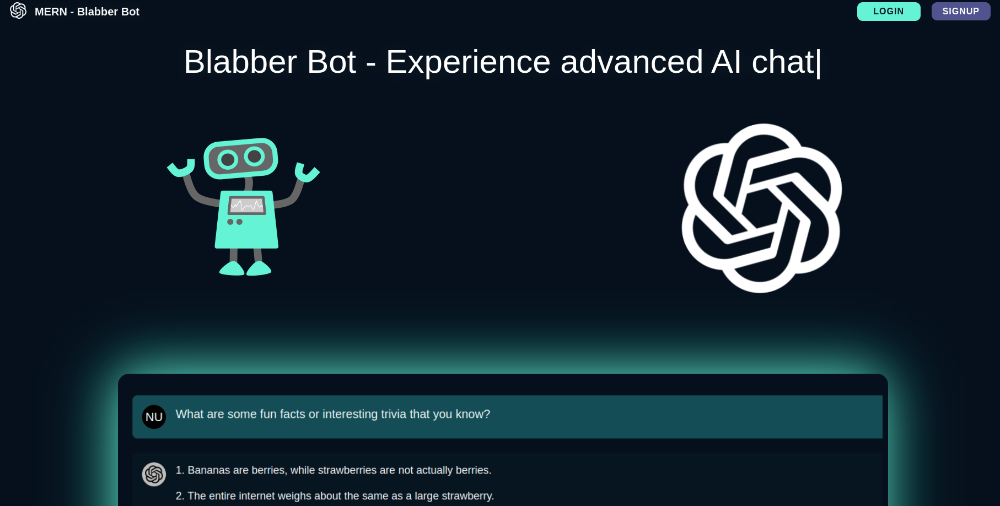

## Mern

<table>
<tr>
    <th align="center">
        
        
 
            <small>
                Project Name
            </small>
        

    </th>
    <th align="center">
        
        
 
            <small>
                Image
            </small>
        

    </th>
    <th align="center">
        
        
 
            <small>
                Repo
            </small>
        

    </th>
    <th align="center">
        
        
 
            <small>
                Demo
            </small>
        

    </th>
</tr>
<tr>
    <td align="center"><strong>Typescript: Blabber Bot</strong></td>
    <td align="center"></td>
    <td align="center"></td>
    <td align="center"></td>
</tr>
</table>
